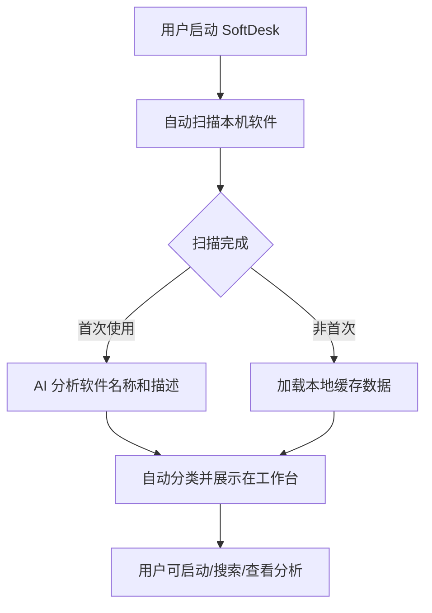
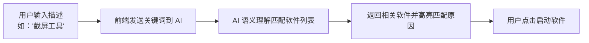
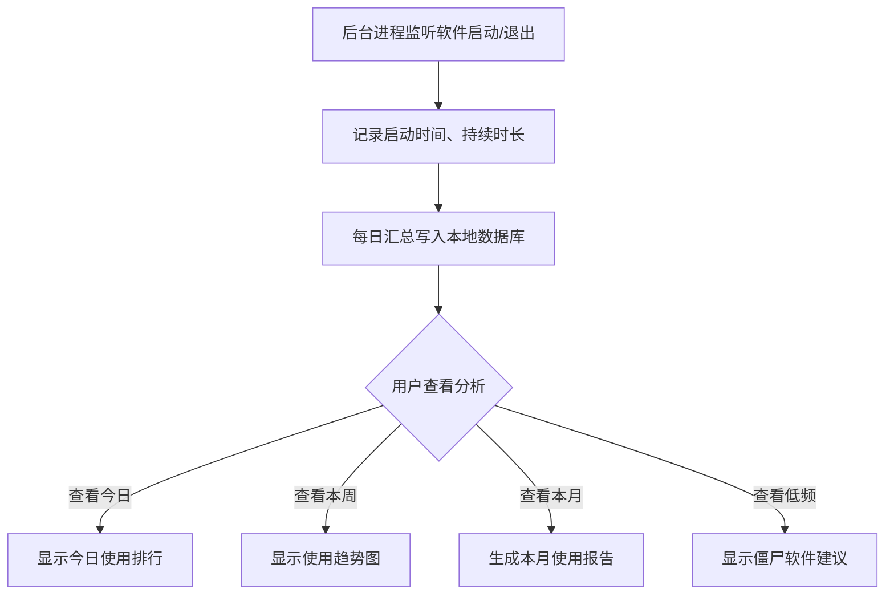

# SoftDesk 产品需求文档（PRD）

## 1. 产品概述

SoftDesk 是一款 AI 驱动的桌面软件智能工作台，旨在解决知识工作者和重度电脑用户在软件管理上的痛点。通过 AI 自动识别软件用途、追踪使用习惯、提供智能工作流建议，让用户从繁琐的手动分类和维护中解放出来。

- **核心定位**：让 AI 替你管软件，而不是你替 AI 做分类
- **目标用户**：程序员、设计师、产品经理、自媒体创作者等日常依赖多款软件完成工作的人群
- **核心价值**：每天节省 10-15 分钟的软件切换和查找时间，重度用户每周多出近 1 小时专注工作时间

---

## 2. 核心功能模块

### 2.1 用户角色

| 角色 | 定义 | 核心需求 |
|------|------|---------|
| 普通用户（Free） | 日常使用电脑，需要找到并管理自己的软件 | 快速找到软件、了解使用情况 |
| 效率用户（Pro） | 程序员/设计师，重度多软件用户 | 自动化工作流、深度数据分析 |
| 极客用户 | 隐私敏感，要求数据不出本机 | 纯本地模式、完全掌控 |

### 2.2 功能模块清单

#### MVP 功能（大赛展示版本）

1. **软件扫描与展示**
   - 自动扫描本机所有已安装软件
   - 显示软件图标、名称、路径、版本信息
   - 支持 Win/macOS 双平台

2. **AI 自动分类**
   - 基于软件名称和描述的语义理解
   - 自动归入预设类别（开发工具、设计软件、办公套件、通讯应用、系统工具等）
   - 无需用户手动操作

3. **快速启动**
   - 点击即可启动任意软件
   - 响应速度与系统启动一致（<200ms）

4. **自然语言搜索**
   - 支持描述性查询（"截屏""修图""做表格"）
   - 基于 AI 语义理解精准匹配
   - 结果按使用频率智能排序

5. **使用时长追踪**
   - 后台记录每款软件的启动次数、累计时长、最后使用时间
   - 数据保存在本地 SQLite 数据库
   - CPU 占用 <1%，不影响系统性能

#### Pro 功能（后续付费能力）

6. **智能工作流编排**
   - AI 分析使用时段规律，自动推荐软件组合
   - 支持用户自定义场景（写代码/做设计/开会）
   - 一键启动多个软件

7. **月度使用报告**
   - 每月自动生成可视化报告
   - 包含时长分布、高频软件、效率建议
   - 支持推送通知

8. **僵尸软件提醒**
   - 超过 N 天未使用的软件标记为"低频"
   - AI 主动建议卸载
   - 显示预估释放空间

9. **批量卸载**
   - 多选软件，一键深度卸载
   - 自动清理残留文件/注册表

10. **使用数据仪表盘**
    - 饼图、柱状图、日历热力图
    - 支持筛选时间段
    - 直观展示软件使用分布

---

## 3. 核心流程

### 3.1 用户首次使用流程



### 3.2 自然语言搜索流程



### 3.3 使用数据分析流程



---

## 4. 页面与模块设计

### 4.1 整体页面结构

```
┌─────────────────────────────────────────────────────────────┐
│  SoftDesk 工作台（桌面应用主界面）                            │
├─────────────────────────────────────────────────────────────┤
│                                                             │
│  ┌─────────┐  ┌────────────────────────────────────────┐   │
│  │         │  │                                        │   │
│  │  侧边栏  │  │              主内容区                   │   │
│  │  导航    │  │                                        │   │
│  │         │  │  ┌──────────────────────────────────┐  │   │
│  │ · 工作台 │  │  │  软件卡片网格                    │  │   │
│  │ · 全部软件│  │  │                                  │  │   │
│  │ · 开发工具│  │  │  [图标] [图标] [图标] [图标]     │  │   │
│  │ · 设计软件│  │  │  VS Code  Figma   Photoshop     │  │   │
│  │ · 办公套件│  │  │                                  │  │   │
│  │ · 通讯应用│  │  │  [图标] [图标] [图标] [图标]     │  │   │
│  │ · 统计   │  │  │  Chrome    Slack    Notion      │  │   │
│  │ · 卸载   │  │  └──────────────────────────────────┘  │   │
│  │         │  │                                        │   │
│  └─────────┘  └────────────────────────────────────────┘   │
│                                                             │
│  ┌─────────────────────────────────────────────────────────┐│
│  │  顶部工具栏：搜索框 | 视图切换 | 设置                    ││
│  └─────────────────────────────────────────────────────────┘│
└─────────────────────────────────────────────────────────────┘
```

### 4.2 页面清单

| 页面名称 | 模块名称 | 功能描述 |
|---------|---------|---------|
| 工作台首页 | 软件卡片网格 | 按 AI 分类展示所有软件，支持拖拽排序 |
| 工作台首页 | 搜索栏 | 顶部固定，支持自然语言搜索 |
| 工作台首页 | 使用概览 | 今日使用时长排行、快捷启动推荐 |
| 全部软件 | 软件列表 | 所有软件按分类展示，支持列表/网格切换 |
| 分类页面 | 分类导航 | 左侧栏显示所有分类，点击切换 |
| 统计页面 | 使用图表 | 饼图、柱状图、日历热力图展示使用数据 |
| 统计页面 | 时长记录 | 每款软件的使用次数、时长、最后使用时间 |
| 卸载页面 | 软件列表 | 显示可卸载软件，支持多选 |
| 设置页面 | 基本设置 | 开机启动、后台运行、AI 模式等 |

---

## 5. UI 设计规范

### 5.1 设计风格定位

**风格关键词**：科技感、数据驱动、智能化、暗色沉浸

**设计理念**：
- 桌面工具软件的视觉语言：专业、高效、可信赖
- AI 能力可视化：通过数据图表、呼吸光效暗示"智能"存在
- 参考方向：Raycast + Linear + VS Code 的设计语言融合

### 5.2 色彩系统

```css
/* 主色调 */
--bg-primary: #0d1117;        /* 主背景：深空黑 */
--bg-secondary: #161b22;        /* 卡片/面板背景 */
--bg-tertiary: #21262d;        /* 悬浮/激活态 */
--bg-hover: #30363d;            /* 悬停态 */

/* 文字色 */
--text-primary: #e6edf3;        /* 主文字：亮白 */
--text-secondary: #8b949e;      /* 次文字：柔灰 */
--text-muted: #6e7681;          /* 辅助文字 */

/* 强调色 */
--accent-primary: #00d4aa;      /* 主强调：科技青 */
--accent-secondary: #58a6ff;    /* 次强调：数据蓝 */
--accent-warning: #d29922;      /* 警告：琥珀 */
--accent-danger: #f85149;       /* 危险：红 */
--accent-purple: #a371f7;       /* AI 特性：高贵紫 */

/* 边框 */
--border-default: #30363d;      /* 默认边框 */
--border-muted: #21262d;       /* 淡边框 */
```

### 5.3 字体系统

```css
/* 显示字体（标题） */
--font-display: 'Space Grotesk', 'Noto Sans SC', sans-serif;

/* 正文字体 */
--font-body: 'Instrument Sans', 'Noto Sans SC', sans-serif;

/* 等宽字体（数据/代码） */
--font-mono: 'JetBrains Mono', 'Fira Code', monospace;

/* 字号梯度 */
--text-xs: 0.75rem;    /* 12px：辅助说明 */
--text-sm: 0.875rem;   /* 14px：次要信息 */
--text-base: 1rem;     /* 16px：正文 */
--text-lg: 1.125rem;   /* 18px：模块标题 */
--text-xl: 1.25rem;    /* 20px：页面标题 */
--text-2xl: 1.5rem;    /* 24px：Hero 标题 */
```

### 5.4 组件样式

#### 软件卡片

```
┌─────────────────────────┐
│  ┌───────────────────┐  │
│  │                   │  │
│  │    [软件图标]      │  │  48x48px，圆角 12px
│  │                   │  │
│  └───────────────────┘  │
│                         │
│  VS Code                │  14px，居中，单行省略
│  ─────────────────      │
│  开发工具 · 今天用 2h   │  12px，灰色，显示分类+使用时长
│                         │
│  [启动]                 │  按钮，accent 色
└─────────────────────────┘

卡片尺寸：160px × 200px
卡片间距：16px
卡片圆角：16px
卡片背景：--bg-secondary
悬停态：边框变 accent，阴影加深
```

#### 侧边导航

```
┌────────────────┐
│  SoftDesk      │  Logo + 文字，accent 色
│                │
│  ──────────    │  分隔线
│                │
│  ◇ 工作台      │  图标 + 文字，选中态：背景 accent/10%
│  ◇ 全部软件    │  悬停态：背景 bg-hover
│  ◇ 开发工具    │
│  ◇ 设计软件    │
│  ◇ 办公套件    │
│  ◇ 通讯应用    │
│  ◇ 系统工具    │
│                │
│  ──────────    │  分隔线
│                │
│  ◇ 统计报告    │
│  ◇ 卸载管理    │
│                │
│  ──────────    │  分隔线
│                │
│  ◇ 设置        │
└────────────────┘

侧边栏宽度：220px
背景：--bg-secondary
选中项：左侧 3px accent 边线，背景 rgba(0,212,170,0.1)
```

#### 搜索框

```
┌─────────────────────────────────────────────────────────┐
│  🔍  输入描述来搜索软件，例如："截屏工具" 或 "做表格"      │
└─────────────────────────────────────────────────────────┘

搜索框高度：48px
圆角：24px（胶囊形）
背景：--bg-tertiary
边框：1px --border-default
聚焦态：边框变为 accent，添加发光效果
占位符文字：--text-muted
```

#### 数据图表

```
饼图配色方案：
- 开发工具：--accent-primary (#00d4aa)
- 设计软件：--accent-purple (#a371f7)
- 办公套件：--accent-secondary (#58a6ff)
- 通讯应用：--accent-warning (#d29922)
- 系统工具：--text-secondary (#8b949e)
- 其他：--bg-tertiary

图表风格：
- 卡片背景：--bg-secondary
- 圆角：16px
- 内边距：24px
- 标签文字：12px --text-secondary
```

### 5.5 动效设计

| 动效场景 | 效果描述 | 参数 |
|---------|---------|------|
| 页面加载 | 卡片从下往上依次出现，带透明度渐变 | `animation: fadeInUp 0.4s ease-out; stagger: 50ms` |
| 悬停 | 卡片轻微上浮 + 边框发光 | `transform: translateY(-4px); box-shadow: 0 8px 24px rgba(0,212,170,0.2)` |
| 分类切换 | 内容区淡入淡出过渡 | `transition: opacity 0.2s ease` |
| 搜索聚焦 | 边框发光 + 图标放大 | `box-shadow: 0 0 0 4px rgba(0,212,170,0.2)` |
| 数据刷新 | 数字滚动动画 | `animation: countUp 0.6s ease-out` |
| AI 处理 | 边框呼吸光效 | `animation: glow 2s ease-in-out infinite` |

### 5.6 图标与视觉元素

- **图标库**：Lucide Icons（线性风格，与整体科技感一致）
- **软件图标**：使用系统原生图标或软件自带图标
- **装饰元素**：
  - 渐变光晕（accent 色系）
  - 细线网格背景（--bg-secondary）
  - 微妙的噪点纹理（透明度 2-3%）

### 5.7 响应式策略

**桌面端为主（桌面应用原型）**：
- 最小窗口：1024 × 768
- 侧边栏固定宽度：220px
- 主内容区自适应剩余空间
- 软件卡片网格：每行 5-8 个（根据窗口宽度）

---

## 6. MVP 交付标准

### 6.1 功能验收

| 功能 | 验收条件 |
|-----|---------|
| 软件扫描 | 首次扫描 < 30 秒（100+ 软件），显示软件图标、名称、路径 |
| AI 分类 | 扫描完成后无需操作，软件自动出现在合理分类下，准确率 > 80% |
| 快速启动 | 点击软件，< 200ms 完成启动 |
| 自然语言搜索 | 输入"截屏"，返回截屏类软件；输入"做表格"，返回 Excel/WPS |
| 使用追踪 | 运行 24 小时后，可查看每款软件的启动次数和累计时长 |

### 6.2 非功能验收

| 指标 | 标准 |
|-----|------|
| 首次加载时间 | < 3 秒 |
| 后台进程 CPU 占用 | < 1% |
| 内存占用（后台） | < 50MB |
| 安装包大小 | < 100MB（不含本地 AI 模型） |
| 数据隐私 | 所有数据本地存储，不上传云端 |

---

## 7. 后续迭代计划

### Phase 1（MVP）：核心管理
- 软件扫描 + AI 分类 + 快速启动
- 自然语言搜索 + 使用追踪

### Phase 2（Pro）：智能增值
- 智能工作流编排
- 月度使用报告
- 僵尸软件提醒

### Phase 3（生态）：商业化
- 软件推荐分发
- 企业版软件资产盘点
- SaaS 订阅成本分析
